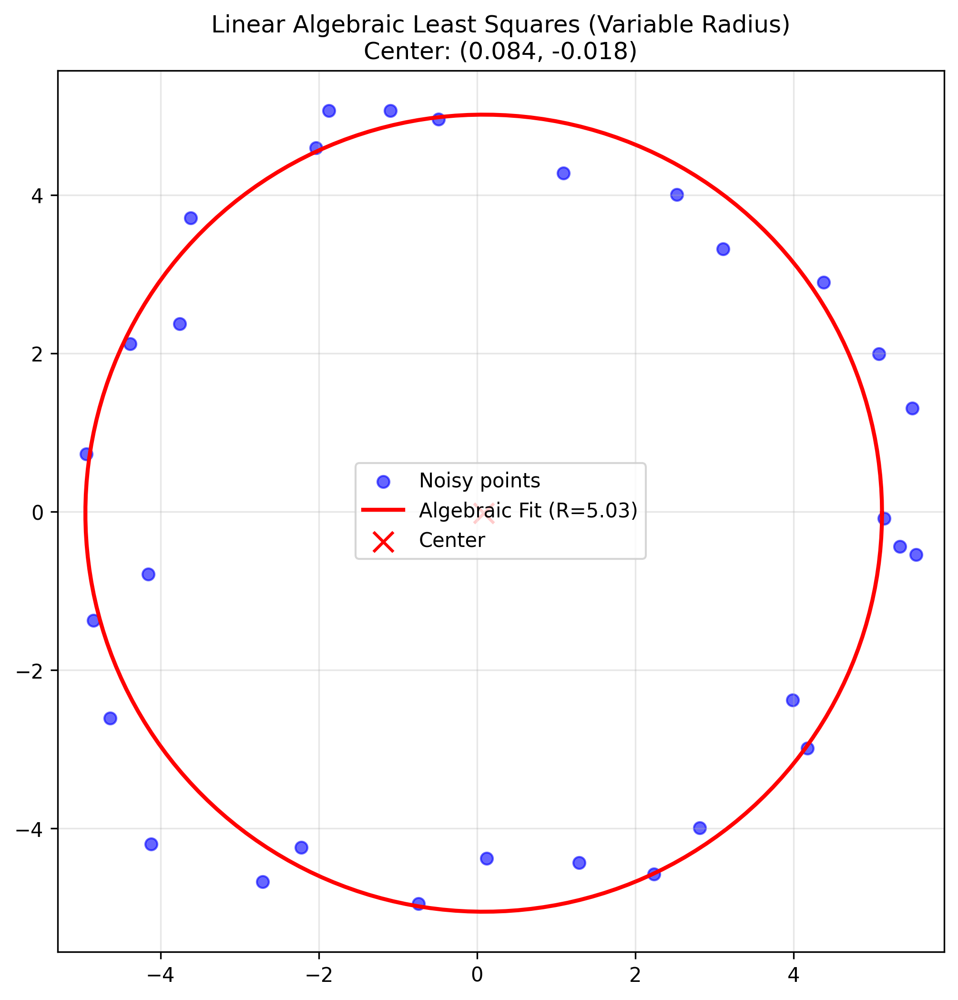

# Robust Geometric Fitting: Hough Transform, RANSAC and Least Squares

A comprehensive implementation of robust estimation and optimization algorithms for detecting and fitting geometric primitives (Circles and Ellipses) in noisy 2D point cloud data. This project explores the trade-offs between parameter-space voting, iterative outlier rejection, and algebraic vs. geometric minimization.

---

## Implemented Algorithms

### 1. Hough Transform (Voting Method)
A discretized parameter space voting system for circle detection with a known radius.
- **Soft Voting**: Uses Gaussian kernels to smooth the accumulator peaks, reducing discretization noise.
- **Sub-pixel Refinement**: Implements a weighted centroid calculation around the peak to achieve higher precision.


### 2. RANSAC (Random Sample Consensus)
A robust iterative method to estimate circle parameters in the presence of a high percentage of outliers.
- **Strategy**: Randomly samples minimum points required to define a circle (2 points + known radius), evaluates inliers within a distance threshold, and selects the model with maximum support.


### 3. Linear Least Squares (Algebraic Fitting)
An efficient, closed-form solution that minimizes the algebraic distance. It converts the non-linear circle equation into a linear system:
x^2 + y^2 + ax + by + c = 0
This method fits both the **center and the radius** simultaneously.



### 4. Radial Least Squares (Geometric Fitting)
An iterative optimization approach (Levenberg-Marquardt) that minimizes the true geometric distance (radial distance) from points to the circle boundary.
- **Constraint**: This implementation focuses on refining the **center position** for a fixed, known radius.


---

## Project Structure

```bash
.
├── Hough_Transform.py       # Voting-based circle detection
├── Ransac.py                # Robust outlier-rejection fitting
├── linear_least_square.py   # Algebraic circle/ellipse fitting
├── radial_least_squares.py  # Iterative radial distance minimization
├── Theory_Report.pdf        # Mathematical derivation and analysis
└── README.md                # Project documentation
```

---

## Tech Stack
- **Python 3.x**
- **NumPy & SciPy**: Matrix operations and optimization.
- **Matplotlib**: 2D visualization of fitting results and error residuals.

---

## Contact
**Rihab Laroussi**  
[GitHub](https://github.com/rihablaroussi) | [LinkedIn](https://www.linkedin.com/in/rihab-laroussi/)
